

  
  <h3 align="center">BnuzLeon</h3>
  

    Rust For Linux 作业报告
   

## 目录

- [索引](#目录)
- [作业1-编译Linux内核](#作业1-编译linux内核)
- [作业2-对Linux内核进行一些配置](#作业2-对linux内核进行一些配置)
- [作业3-使用rust编写一个简单的内核模块并运行](#作业3-使用rust编写一个简单的内核模块并运行)
- [作业4-为e1000网卡驱动添加remove代码](#作业4-为e1000网卡驱动添加remove代码)
- [作业5-注册字符设备](#作业5-注册字符设备)

## 作业1-编译linux内核

Step1: 会生成适用于 x86_64 架构的默认配置文件

> make x86_64_defconfig

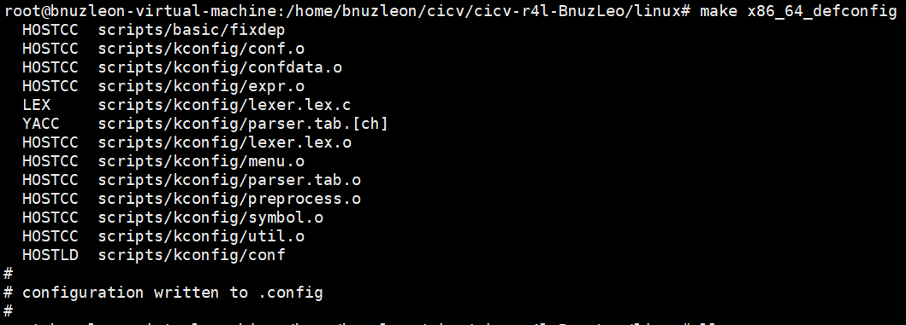

Step2: 配置linux内核

- 命令

> make LLVM=1 menuconfig

- LLVM=1

> 通常情况下，Linux 内核会使用 GCC（GNU Compiler Collection）作为默认的编译器。这里LLVM=1是告诉内核编译系统使用LLVM（Low Level Virtual Machine）来编译。

- menuconfig

> menuconfig 是一个交互式工具，它允许你在命令行界面中配置 Linux 内核。

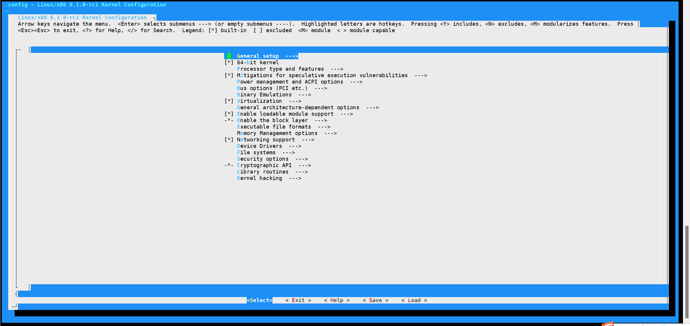

Step3: 开始编译内核

> make LLVM=1 -j$(nproc)

- -j$(nproc)

> -j$(nproc): 这个参数用来指定并行编译的任务数量。

> -j 参数后面的 $(nproc) 表示使用系统的可用处理器核心数量作为并行编译任务的数目。这样做可以加快编译速度，因为它允许多个任务同时运行，利用多核处理器的能力。

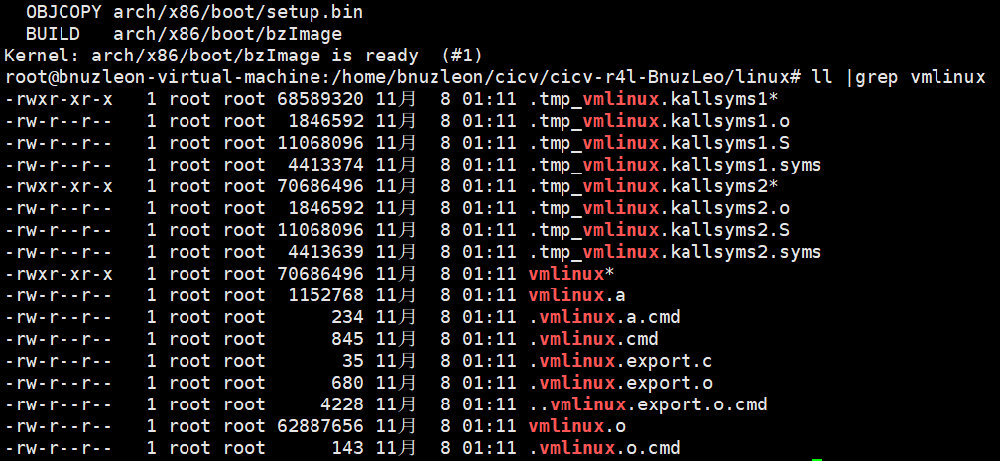

## 作业2-对linux内核进行一些配置

Step 1: 关闭Linux内核默认的e1000网卡驱动

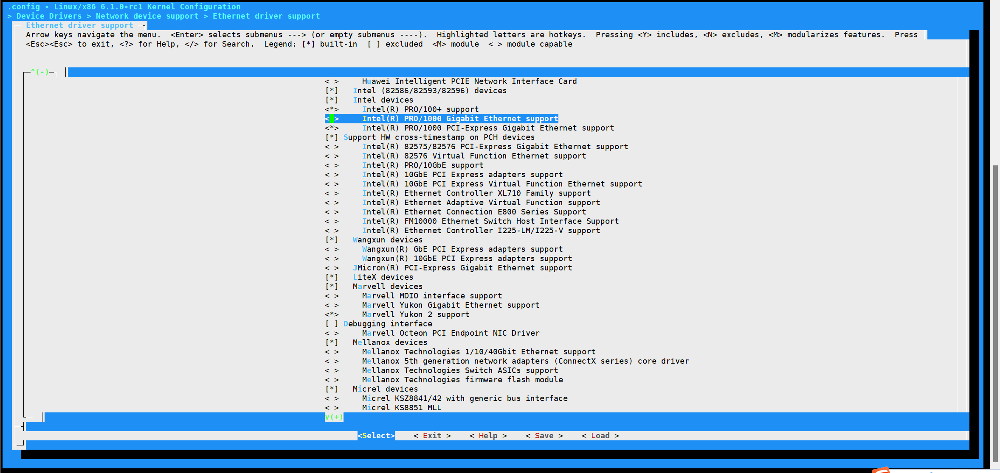

Step2: 重新编译Linux内核

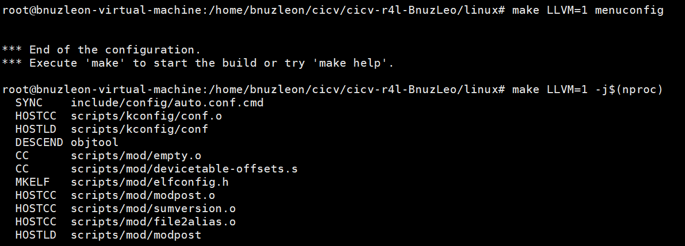

Step3: 进入内核确认不能ping通联通网络

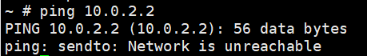

Step4：手动配置，让他联网，且能ping通联通网络

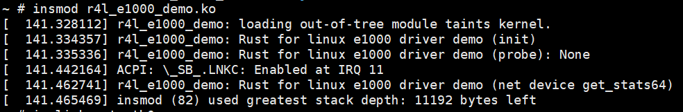

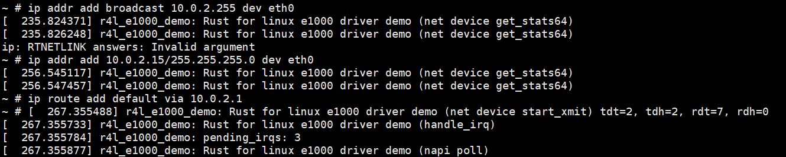

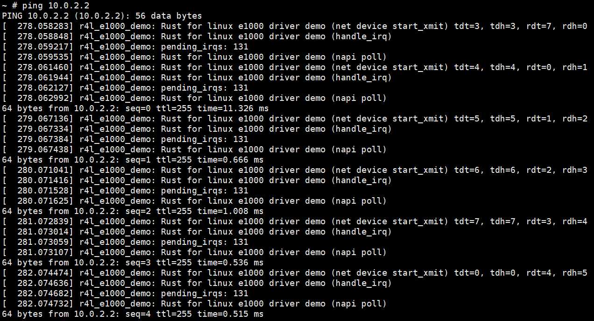

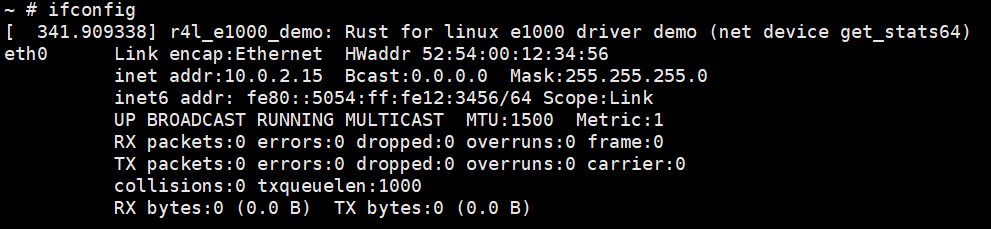

## 作业3-使用rust编写一个简单的内核模块并运行
Step1: 添加/samples/rust/rust_helloworld.rs文件

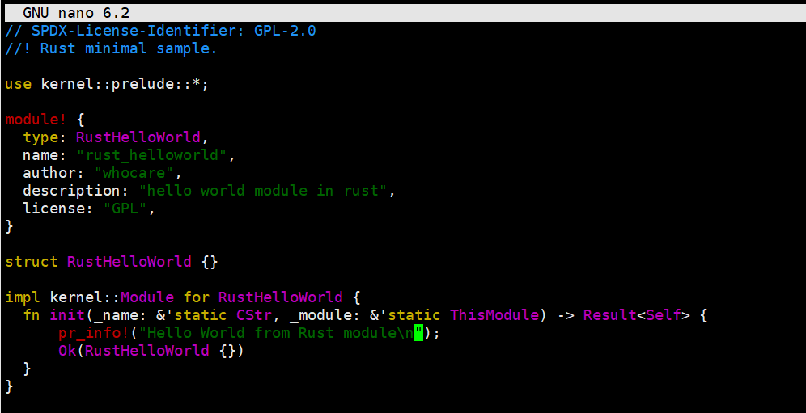

Step2: 修改Kconfig和Makefile

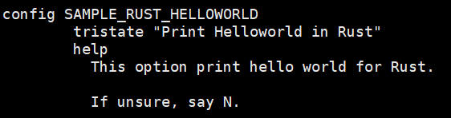

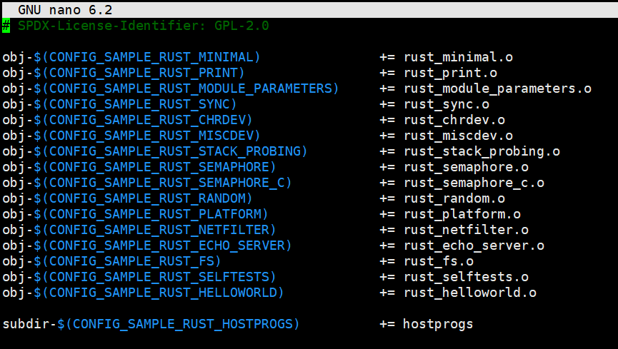

Step3：选择“Print Helloworld in Rust" 然后编译成模块

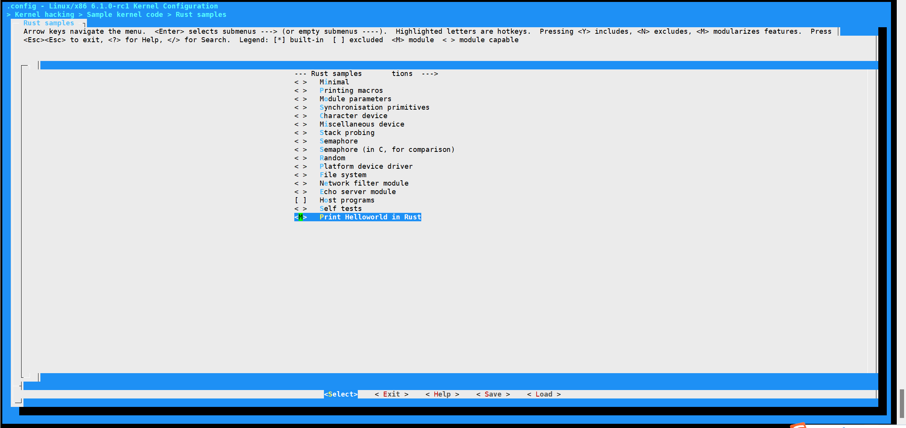

Step4：重新编译内核

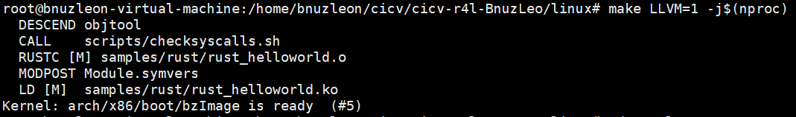

Step5：把/samples/rust/rust_helloworld.rs复制到/src_e000/rootfs中，重新跑build_image.sh

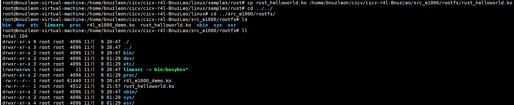

Step6：进入内核安装模块

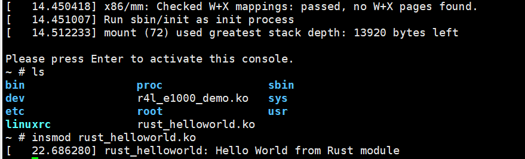

## 作业4-为e1000网卡驱动添加remove代码
Step1: 确认无法上网

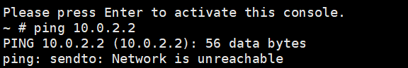

Step2: 通过作业二的方法，让内核再次可以上网

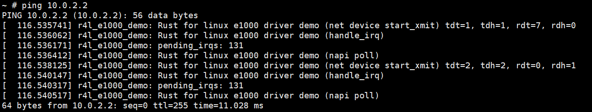

Step3：补充src_e1000/r4l_e1000_demo.rs的代码

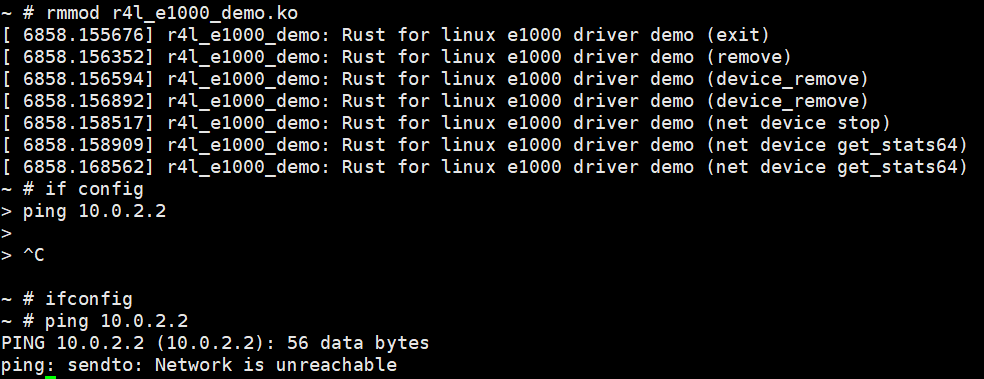

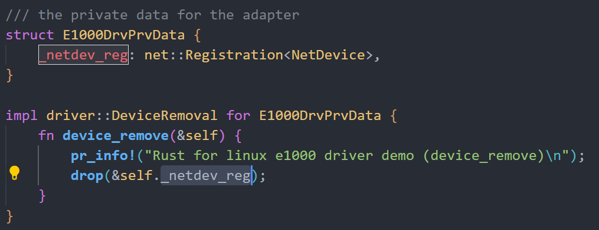

Step4：执行rmmod r4l_e1000_demo.ko，移除模块，无法上网

Step5：再通过作业2的方法，加载模块，顺利ping通 (还是不行)

## 作业5-注册字符设备

Step 1: 打开Character device模块的编译配置

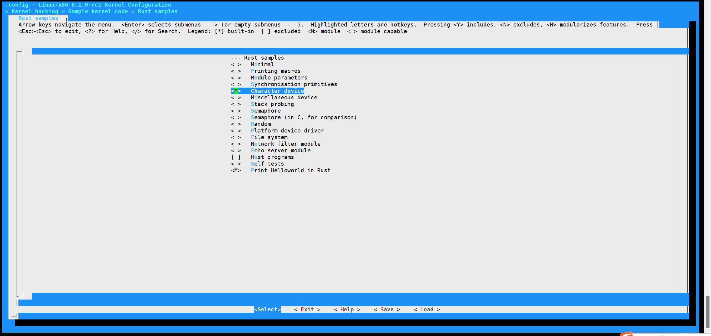

Step2：重新编译linux内核，然后进入内核

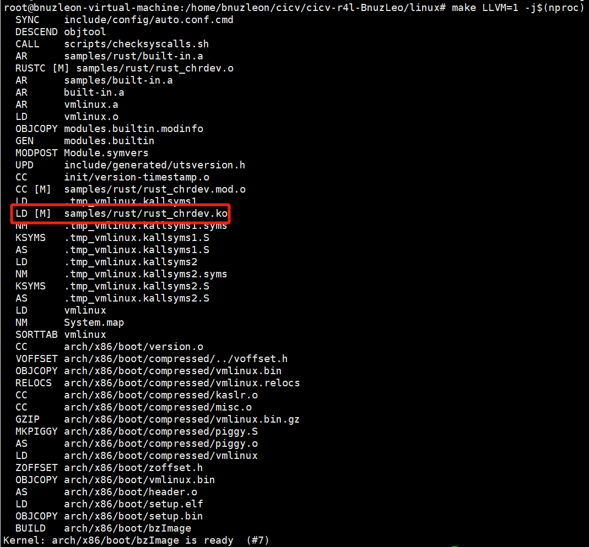

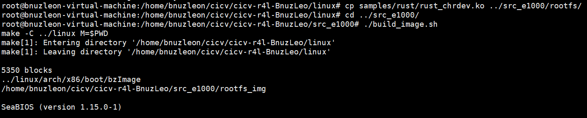
Step3：加载驱动并验证结果
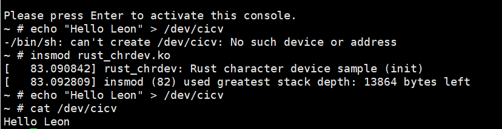
